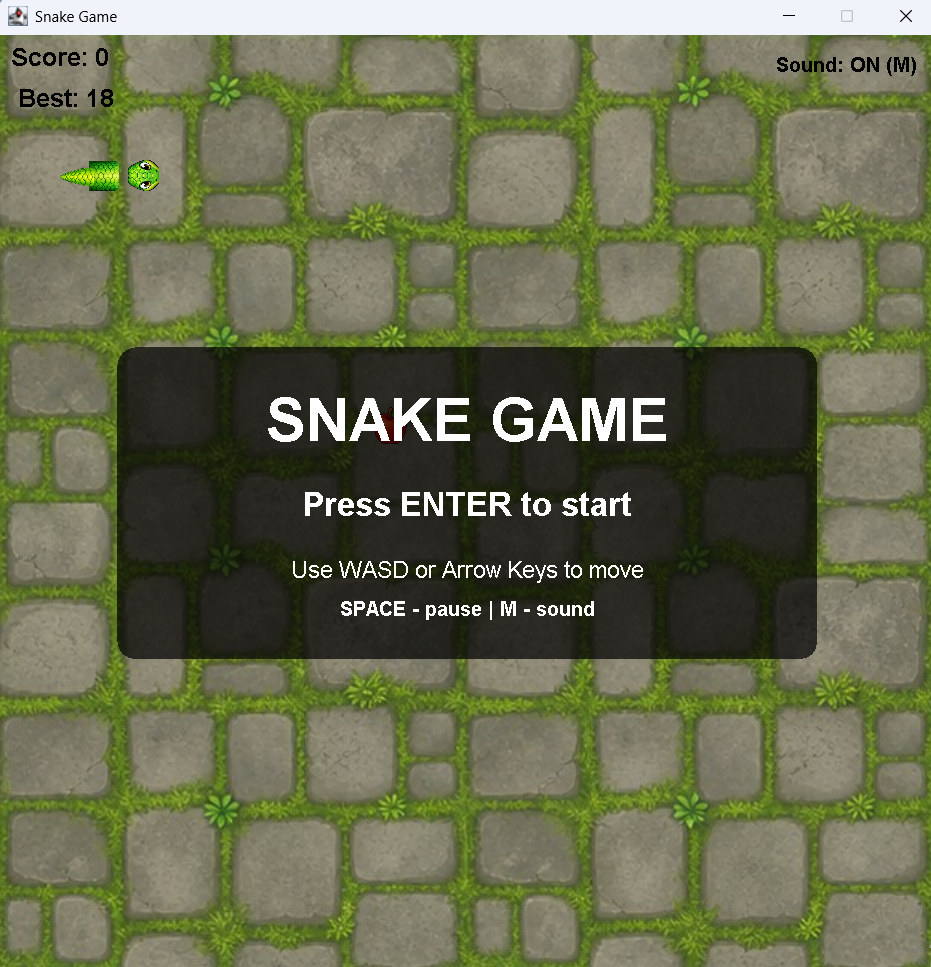
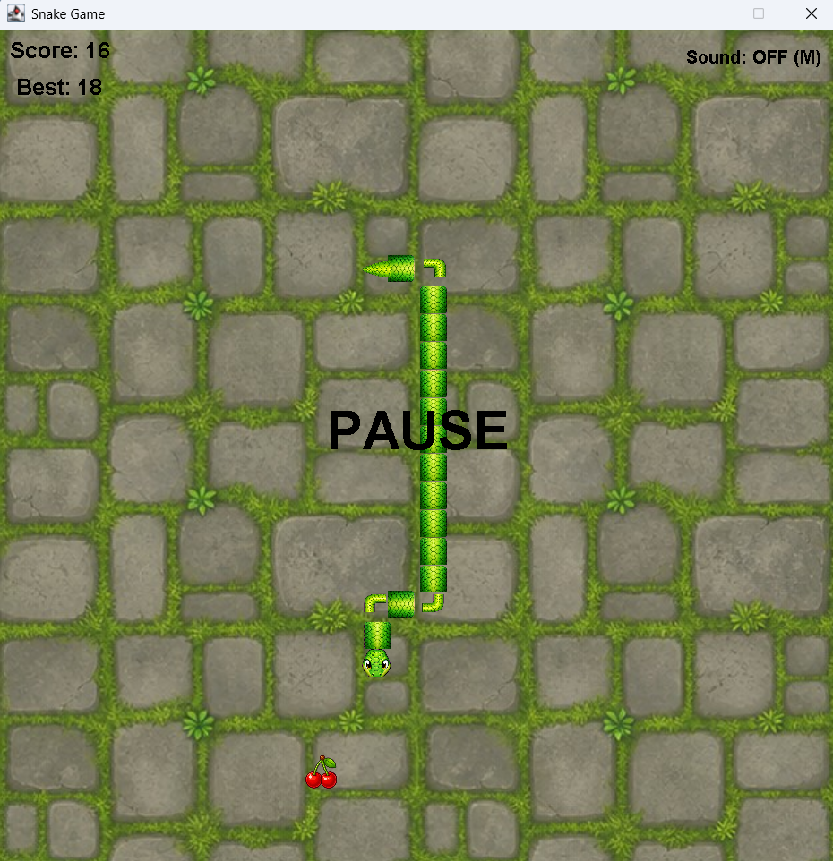
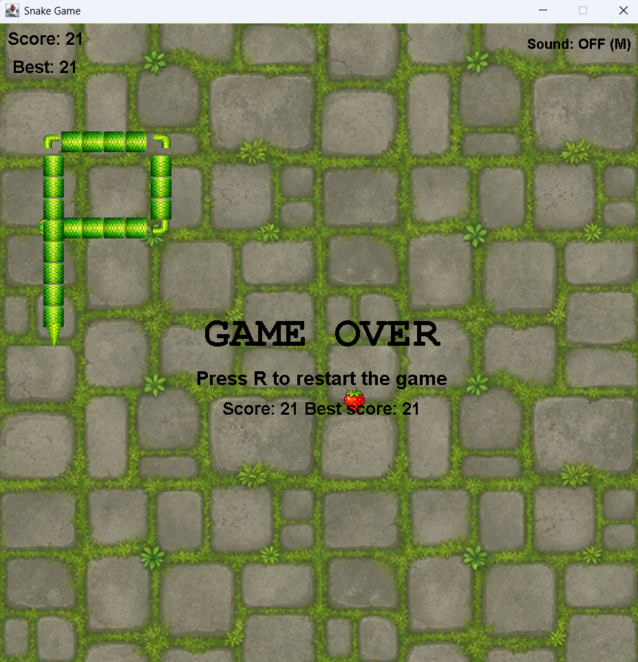

# Snake Game

A polished version of the classic Snake game built from scratch with Java
Swing and no external libraries.

## Features

- Movement with arrow keys or `WASD`
- Snake growth after eating food
- Six randomly selected fruit sprites
- Random food placement outside the snake's body
- Wall and self-collision detection
- Persistent best score
- Gradual speed increase every five points
- Start, pause, restart, and game-over screens
- Sound effects with a mute control
- Direction-aware head, body, corner, and tail textures
- Custom game background

## Controls

| Key | Action |
| --- | --- |
| Arrow keys / `WASD` | Move |
| `Enter` | Start |
| `Space` | Pause or resume |
| `R` | Restart |
| `M` | Toggle sound |

## Technologies

- Java
- Swing
- IntelliJ IDEA

## Run Locally

1. Open the `SnakeGame` folder in IntelliJ IDEA.
2. Make sure a JDK is selected for the project.
3. Mark `src` as **Sources Root**.
4. Mark `resources` as **Resources Root**.
5. Run `SnakeGame.java`.

No external libraries are required.

## Project Structure

```text
SnakeGame/
|-- docs/
|   |-- linkedin-post.md
|   |-- project-description.md
|   `-- screenshots/
|-- resources/
|   |-- food/
|   |-- skins/
|   |-- sounds/
|   `-- background.jpg
|-- src/
|   |-- GamePanel.java
|   `-- SnakeGame.java
|-- .gitignore
`-- README.md
```

## Screenshots

### Start Screen



### Gameplay



### Game Over



## What I Practised

- Java and object-oriented programming
- Swing rendering and keyboard events
- Timer-driven game loops
- Collections and coordinate-based movement
- Collision detection
- Resource loading and audio playback
- Persistent settings with `Preferences`

## Possible Future Improvements

- Skin and map selection
- Multiple game modes
- Obstacles and bonus food
- Packaged executable release

## License

This project is available under the [MIT License](LICENSE).
